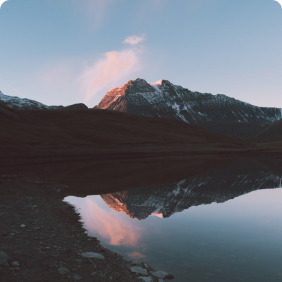

# Project 3: Around The U.S.

### Project Name:

Around The U.S.

### Description:

This project is designed to showcase various tourist attractions around the U.S. It allows users to browse through various locations, view images, and read descriptions about these places.

### Technologies and Techniques Used:

- HTML5
- CSS3
- Flexbox
- Grid Layout
- Media Queries for responsive design
- BEM methodology for structuring CSS classes
- Figma for design references

### Project Features:

- A fully responsive website that adjusts seamlessly to different screen sizes.
- Organized and structured code using BEM methodology.
- High-quality images optimized for faster load times.

[Project screenshot](./images/Screen%20Shot%202024-08-18%20at%2011.08.28%20AM.png)

## Live Demo

You can view the project live at: [Live Demo](https://iavor96.github.io/se_project_aroundtheus/)

## Video about Project

https://drive.google.com/file/d/1WlxJ8cCedb4hNJ89p34W8-ups5mw60ZN/view?usp=sharing

<li class="card">
              
              

                <h2 class="card__title">Yosemite Valley</h2>
                <button class="card__like-button" type="button"></button>
              

            </li>
            <li class="card">
              
              

                <h2 class="card__title">Lake Louise</h2>
                <button class="card__like-button" type="button"></button>
              

            </li>
            <li class="card">
              
              

                <h2 class="card__title">Bald Moutains</h2>
                <button class="card__like-button" type="button"></button>
              

            </li>
            <li class="card">
              
              

                <h2 class="card__title">Latemar</h2>
                <button class="card__like-button" type="button"></button>
              

            </li>
            <li class="card">
              
              

                <h2 class="card__title">Vanoise National Park</h2>
                <button class="card__like-button" type="button"></button>
              

            </li>
            <li class="card">
              
              

                <h2 class="card__title">Lago Di Braises</h2>
                <button class="card__like-button" type="button"></button>
              

            </li>
